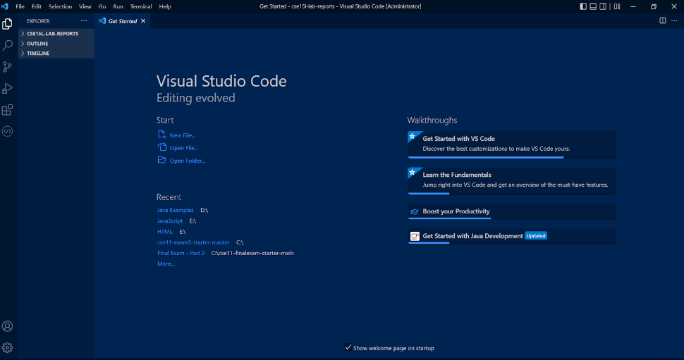
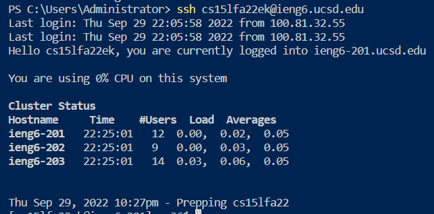
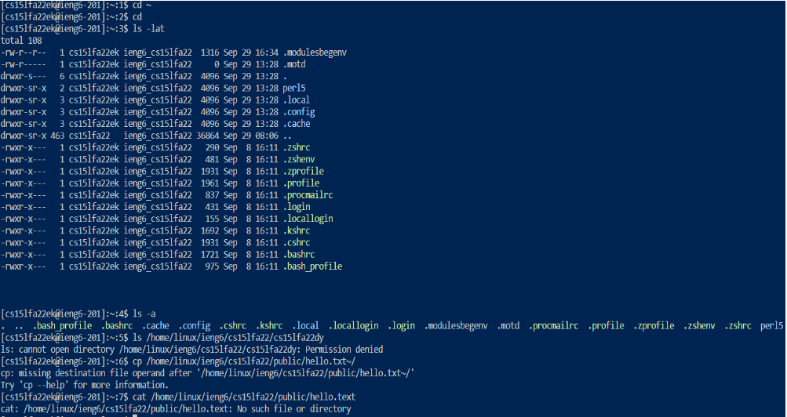
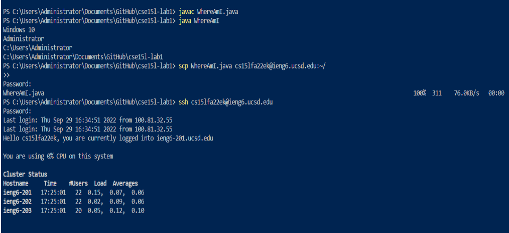
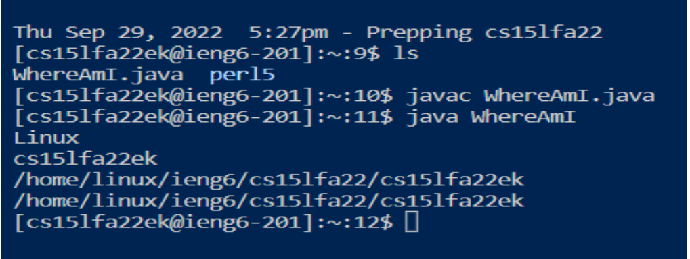
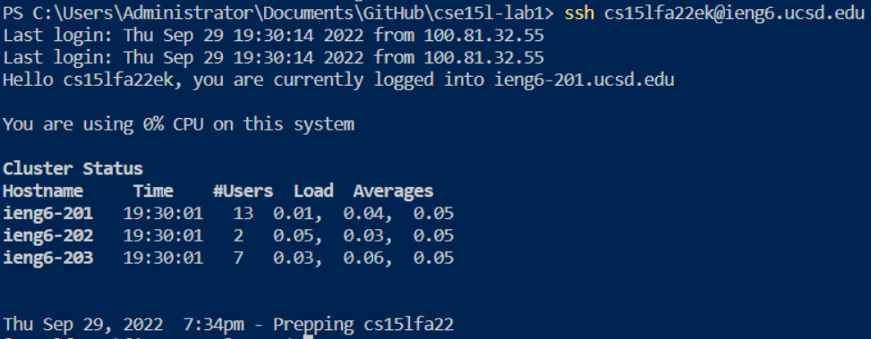
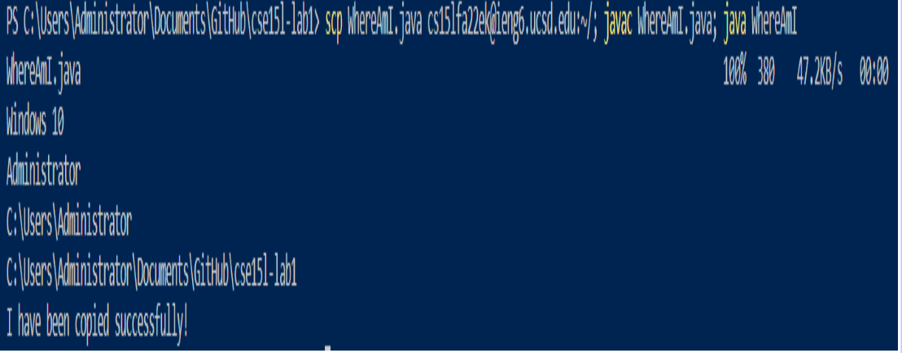

# Week 1 Lab Report
## Foreword and Note:
### I referred to nevzatseferoglu's answer in [this stackflow post](https://stackoverflow.com/questions/41604263/how-do-i-display-local-image-in-markdown) to insert images to this markdown file. It's worth of having a look. In addition, if you are interested in a more detailed explanation in the topics I will go over soon, feel free to refer to our [CS 15L course website at UCSD](https://ucsd-cse15l-f22.github.io/week/week1/). **Also, if you are a UCSD student, the first step is to change your password of your assigned CSE 15L course account by Account Lookup Tool. Please completely follow [this doc](https://docs.google.com/document/d/1hs7CyQeh-MdUfM9uv99i8tqfneos6Y8bDU0uhn1wqho/edit) to change password. Any inconsistency, such as "clicking  check password button" can delay your password reset for hours. You may wait for 15 to 60 minutes before the new password becomes effective.*** 
<br>


## Howdy, my dear readers! This is Bowen Yi. Welcome to this week's lab report. Today, I will go through almost everything you need to know about remote connecting. Here's a directory of the report content:

> [1. Installing VScode](*)
>
> [2. Remotely Connecting](*)
>
> [3. Trying Some Commands](*)
>
> [4. Moving Files with scp](*)
>
> [5. Setting an SSH Key](*)
>
> [6. Optimizing Remote Running](*)

<br>

## Part 1: Installing Visual Studio Code
> ### The remote connecting activity will be operated on VScode. Usually, we are able to connect to computers remotely by coding on VScode in our personal computer. So, it is rather crucial to install it successfully. 

<br>

### To install VScode, follow the steps below:
 - ### Go to the VScode website:  <https://code.visualstudio.com/>. Follow the instructions and download it on your computer. **Reminder: make sure to download the version corresponding to your operating systems, like Windows and Mac.**
 <br>


 
 - ### Once installed, this window (see the image below) should welcome you on VScode, though it differs across different operating systems (Since I'm using Windows, Mac users may see a different main page from mine).  
 
 


 <br>
 
 ## Part 2: Remotely Connecting
 >### The next step, we will install a program called OpenSHH, a program that empowers our PCs to connect to remote computers using VScode. We can also deem this program an indispensable context, or environment, for using VScode to connect remotely. 

 <br>

 - ### Follow [this article](https://ucsd-cse15l-f22.github.io/week/week1/#part-4--remotely-connecting) to install OpenSHH and make sure you install the **client** (meaning your own computer) version, not the **server** (meaning remote computers) version. 

 <br>
 
 - ### After installing OpenSHH, open a new terminal in VScode. To do so, you can try:
    * Ctrl + `
    * Command + `
    * Use the menu option on top left: Terminal → new terminal

<br>
 
 - ### Then, run this command on the terminal: `$ ssh cs15lfa22zz@ieng6.ucsd.edu`. Replace `cs15lfa22zz` by your own username for CSE 15L. Here, the ssh command stands for secure shell. Refer to [this article](https://www.redhat.com/sysadmin/ways-use-ssh#:~:text=Secure%20shell%20(SSH)%20is%20one,easy%20to%20add%20to%20Windows.) for more details. The function of this command is that: it initiates the process to enter the server identified by your course username.   
 <br>

 - ### If your username has been input correctly, you will see this chunk of code below. Just type "yes" in response and press enter. After that, you will input your password (which won't show in the terminal while typing). 
 ```
 ⤇ ssh cs15lfa22zz@ieng6.ucsd.edu
The authenticity of host 'ieng6.ucsd.edu (128.54.70.227)' can't be established.
RSA key fingerprint is SHA256:ksruYwhnYH+sySHnHAtLUHngrPEyZTDl/1x99wUQcec.
Are you sure you want to continue connecting (yes/no/[fingerprint])?
Password: 
```

<br>

- ### Once you give your password and log in, the whole interaction will be similar to this, which means you have successfully entered the remote computer.

```
# Now on remote server

Last login: Sun Jan  2 14:03:05 2022 from 107-217-10-235.lightspeed.sndgca.sbcglobal.net
quota: No filesystem specified.
Hello cs15lfa22zz, you are currently logged into ieng6-203.ucsd.edu

You are using 0% CPU on this system

Cluster Status 
Hostname     Time    #Users  Load  Averages  
ieng6-201   23:25:01   0  0.08,  0.17,  0.11
ieng6-202   23:25:01   1  0.09,  0.15,  0.11
ieng6-203   23:25:01   1  0.08,  0.15,  0.11

Sun Jan 02, 2022 11:28pm - Prepping cs15lfa22
```
<br>

  - ### Later on, when you log in, your terminal will look like this (there should be a line of code: `Password:` after you type the ssh command. It's missing here because I used a technique called public key (see part 7 of our [course website](https://ucsd-cse15l-f22.github.io/week/week1/#part-3--visual-studio-code)), which once implemented skips the password asking):  
  


<br>

## Part 3: Trying Some Commands
>### Congrats on entering your server! Now, it's time to explore some useful commands on your PC and remote computer. 
<br>

- ### Here are some commands I've tried, but you are welcome to try more commands listed in this comprehensive [Linux commands dictionary](https://www.rapidtables.com/code/linux/ls.html). 


<br>

### Here is a brief explanation on the function of those commands I implemented above:
- ### `cd ~`: change the current directory to the home directory
- ### `cd`: functions same as cd ~
- ### `ls -lat`: show all files, including those hidden ones, in long format and chronological order
- ### `ls -a`: show hidden files
- ### `ls <directory>`: it should show me the file whose path is /home/linux/ieng6/cs15lfa22/cs15lfa22dy. However, because we are required a password to enter this file, it shows me this default message, “Permission denied.”
- ### `cp <directory1, where we copy files from> <directory2, where we want to copy and send our files in directory 1 to>`: copy files in one directory to another directory. Since our destination directory is missing, it shows me a “missing destination file” message.
- ### `cat`: it will concatenate and read files. Since there is no such as file on this path, it shows me the message, “No such file or directory.”

<br> 

## Part 4: Moving Files with scp 
>### One key step to work remotely is being able to copy files back and forth between computers. We will use the command, `scp`, to do this. Here are steps to implement this command:
<br>

- ### we can only run `scp` on our computer. The grammar for this command is: `scp <directory/file name that we want to copy to the destination file in remote computers> <destination file>` on our own command. For example, `scp <WhereAmI.java> <cs15lfa22zz@ieng6.ucsd.edu:~/>` will copy the file WhereAmI.java in our computer to the directory in the remote server whose path being `cs15lfa22zz@ieng6.ucsd.edu:~/`. 
<br>

- ###  There's an example to help you understand better. I've created a file, named [WhereAmI.java](cs15l-lab1/WhereAmI.java), on my computer. After typing the command `scp WhereAmI.java cs15lfa22zz@ieng6.ucsd.edu,` I compile the file on the remote computer and can see this chunk of code in my terminal. If you try the same thing, you should be able to see similar code.



<br>

## Part 5: Setting an SSH Key
>### If you remember how my terminal looked like at the end of Part 2, you may wonder why I doesn't need a password to log in, which saves a lot of time! I actually used a technique called public key. The idea behind public key is that program, called ssh-keygen, creates a pair of files called the public key and private key. You copy the public key to a particular location on the server, and the private key in a particular location on the client. Then, the ssh command can use the pair of files in place of your password. This is a common setup step in lots of work environments that involve code on a server (Cited from the course website).

<br>

1.  ### If you are a **Mac** user, 
    - ### Type the key generator command on the terminal of **your own computer**, which will be: `ssh-keygen`. Then, press enter all the way until a diagram shows in your terminal. 
     -  ### This created two new files on your system; the private key (in a file id_rsa) and the public key (in a file id_rsa.pub), stored in the .ssh directory on your computer. 
     - ### Once done it, we start to copy the public key from our computer to the server by logging in the account: `ssh cs15lfa22zz@ieng6.ucsd.edu` and type your password. 
     - ### Once logged in, make a new directory .ssh by typing the command, `mkdir .ssh`.
     - ### Finally, use the scp command followed by the path to where our public file is saved and the path of the .ssh file we just created. Follow the pattern of the chunk of code below: 
```
# on client (your computer)
$ ssh-keygen
Generating public/private rsa key pair.
Enter file in which to save the key (/Users/joe/.ssh/id_rsa): /Users/joe/.ssh/id_rsa
Enter passphrase (empty for no passphrase): 
Enter same passphrase again: 
Your identification has been saved in /Users/joe/.ssh/id_rsa.
Your public key has been saved in /Users/joe/.ssh/id_rsa.pub.
The key fingerprint is:
SHA256:jZaZH6fI8E2I1D35hnvGeBePQ4ELOf2Ge+G0XknoXp0 joe@Joes-Mac-mini.local
The key's randomart image is:
+---[RSA 3072]----+
|                 |
|       . . + .   |
|      . . B o .  |
|     . . B * +.. |
|      o S = *.B. |
|       = = O.*.*+|
|        + * *.BE+|
|           +.+.o |
|             ..  |
+----[SHA256]-----+

# on client
$ ssh cs15lfa22zz@ieng6.ucsd.edu
<Enter Password>
# now on server
$ mkdir .ssh
$ <logout>
# back on client
$ scp /Users/joe/.ssh/id_rsa.pub cs15lfa22@ieng6.ucsd.edu:~/.ssh/authorized_keys
# You use your username and the path you saw in the command above
```
<br>

### If you are a **Windows** user, your first substep will be different. Refer to [this document](https://learn.microsoft.com/en-us/windows-server/administration/openssh/openssh_keymanagement#user-key-generation) for more information. Other steps should be the same. Finally, your terminal will be like this if every command runs successfully; and you will also be able to log in without password:


  
<br>

## Part 6: Optimizing Remote Running


> ### Based on what we have learned so far, we can use some shortcuts to make inter-computer copy faster. There are multiple ways you can do it and I'll show you my way below.

<br>

 ### I want to copy WhereAmI.java file to the remote server and compile it, running the System.out.println("I've been copied successfully) method inside. Here's what I did: (in case the image is blurry, my command is `scp whereAmI.java cs15lfa22ek@ieng6.ucsd.edu; javac WhereAmI.java; java WhereAmI`)
 

 <br>

 ### You'll notice that this line of code actually implements several commands together. We can do that by seperating each command with a semicolon. 

<br>

<br>

 ## That comes to the end of this lab work. Hope you enjoy it. Please feel free to explore our course website if you're interested in learning more about today's content. 
 
 ## See you next week!

   


